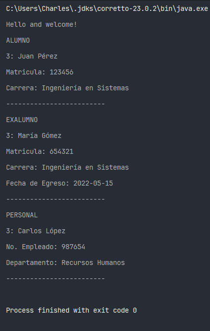

# Herencia en JAVA
Ejemplo basico de herencia en Java.
Este ejemplo muestra una estructura sobre el personal de la FES Aragon con las siguiente entidades. 
- [Personal](./src/personal/Personal.java)
- [Alumno](./src/personal/Alumno.java)
- [Exalumno](./src/personal/Exalumno.java)

Estas entidades heredan de la clase [PersonalAragon](./src/personal/PersonalAragon.java) la cual implementa la interfaz [IPersonalAragon](./src/interfaces/IPersonalAragon.java).

## Salida
